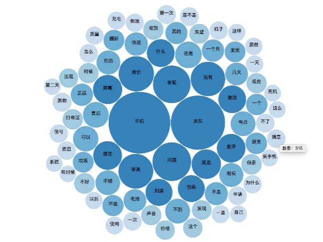
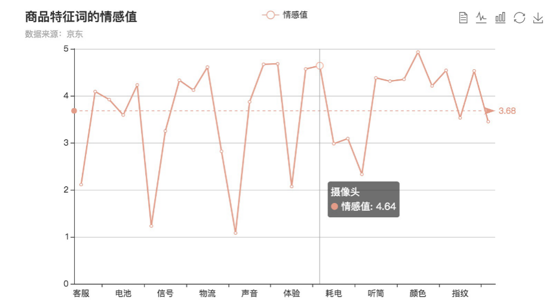
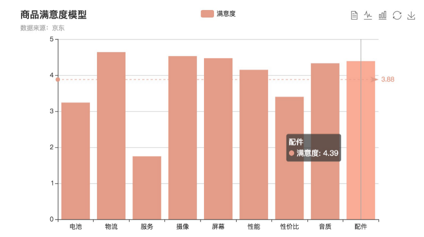

# 基于京东商品评论数据的客户满意度分析

## 一、项目简介

本项目基于用户的评论数据，较为快速、准确地分析出用户对于该商品某一特征反馈的褒贬程度和满意度。分析结果对于客户来说能节约较大的时间成本和精力，提升购物体验；对于厂商来说，有助于让厂商及时的获取到更为精准的商品使用信息，在出现问题时可以及时纠正，也可以在市场商机出现时及时把握

## 二、数据来源

本项目的数据（商品评论数据）来源于京东，共22387条

## 三、技术和工具

### 1、数据获取

编写**python**爬虫爬取数据（[**点击查看源码**](https://github.com/kikoxxxi/graduation-project)）

主要利用Python的Scrapy框架、编写re正则表达式和xpath提取并清洗所需字段，并存储至MySQL数据库中

### 2、数据处理和分析

采用Python的jieba分词模块对商品评论数据进行分词处理

使用pyltp进行依存句法分析，基于情感字典进行情感分析

### 3、数据可视化

根据分析结果构建满意度模型，并通过d3.js和Echarts进行数据可视化

## 四、数据分析（以京东Apple iphone7评论数据为例）

### 1、中文分词

中文分词是指讲一句话切分成一个个单独的词语。中文不同于英文，在英文中具有明确的分界符即空格，而中文的分界符只存在于句与句、段落与段落之间，在词汇中并不能用分界符来切分。现有的分词算法主要有三大类即基于理解的分词方法、基于字符串匹配的分词方法和基于统计的分词方法。

本项目采用了Python的jieba分词模块对商品评论关键词进行提取

从中可以看出“降价”、“屏幕”、“包装”、“电池”、“信号”等出现的频次高，说明用户对于这款手机的主要关注点在于手机的价格、电池、信号、屏幕等方面。但是还并不能判断这些焦点在用户眼里是正面的还是负面的，也就是用户的情感倾向还不能根据分词处理频率统计结果来确定。需要根据之后的分析方法来求证

### 2、基于依存句法的情感倾向分析

依存句法分析也就是利用句子中词与词之间的依存关系来揭示词语的句法结构信息（如动宾关系、主谓关系、定中关系、介宾关系等）。简单来说，依存句法分析识别句子中的“主谓宾定状补”等语法成分，并分析这些成分之间的关系。本项目采用哈工大LTP依存句法分析器，该工具使用流水线的方式将各个分析工具（分词、词性标注、依存句法分析）结合起来，形成统一的依存句法分析处理系统。依存句法分析将句法结构分为十四种，常见的有：SBV（主谓关系）、VOB（动宾关系）、COO（并列关系）、ADV（状中结构）、ATT（定中关系）等。

基于依存句法的情感倾向分析是从以下三个方面计算情感值：一是情感词的极值；二是情感修饰词的强度；三是否定词和修饰副词的位置情况。

情感词的情感倾向分为积极和消极，其极值由其表现的积极程度或消极程度所决定。例如“不错”和“完美”这两个词都是带有积极色彩的，只不过它们的积极情感倾向程度有差别，“不错”的积极情感倾向比“完美”的积极情感倾向要弱很多。本项目的情感词典是由台湾大学情感词典、知网情感分析词典以及部分人工添加词组成。这两种词典都自带情感极值，对于人工添加的词语则根据主观进行赋值。

情感修饰词一共有三类，一类是削弱情感程度；一类是增强情感程度；最后一类是否定即反转情感倾向。例如“超级清晰”，其中“超级”就是对“清晰”情感的一种增强。“有点清晰”，其中“有点”则对“清晰”情感弱化。本项目对“超级”、“极其”、“非常”等这类强化情感的修饰词设置大于1小于等于2.5的不同程度的权重，对“有点”、“有些”、“稍微”等这类弱化情感的修饰词设置小于1大于0的权重。

对同时含有修饰副词和否定词的句子情感值总结出其计算方式如下：当修饰副词位于否定词的后面时，这时削弱程度较低，所以将否定词和修饰副词综合权值设为1/w，w为修饰副词的权重，即修饰副词权重的倒数；当修饰副词位于否定词的前面时，这时是情感倾向的反转，所以将否定词和修饰副词综合权值设为-1*w

从图中可以看出Apple iphone7电池、信号、发热等特征词情感值低于平均情感值，所以电池耗电、信号弱、发热现象等问题较为突出，摄像头、包装、速度、系统、外观、耳机、手感等特征词情感值高于平均值，倾向褒义的程度较大，更受顾客好评

### 3、基于特征词的客户满意度

综合所有特征词，同义归类计算平均情感值作为客户满意度模型。例如，特征词“配件”、“数据线”、“耳机”、“充电器”可以综合归为“配件”，将“配件”作为满意度指标之一

从上图可以看出Apple iphone7手机在电池、售后服务方面用户是不太满意的，在摄像、性能、音质、配件方面得到了用户的高度认可。所以除了在手机的功能等方面积极创新获得用户认可，同时也要注意提高产品的售后服务来获得更多的用户认可

